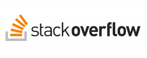
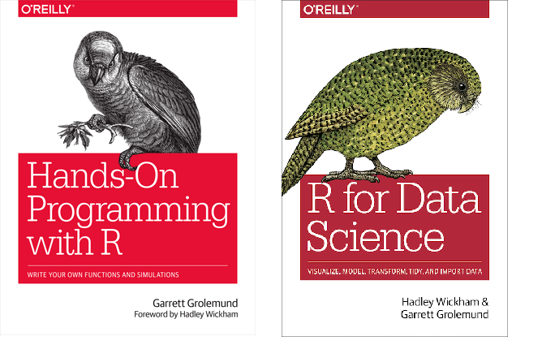

layout:true

<div class="my-footer"><span>
</span></div>

---
class: 

```{r echo = FALSE,setup, include=FALSE}
options(htmltools.dir.version = FALSE)

knitr::opts_chunk$set(fig.align = "center", message=FALSE, warning=FALSE)

library(tidyverse)

```

# Dinâmica do Curso

<br><br><center></center>

---

# O que é R ? 

<br><br><center></center>

---

> "R é um ambiente de software livre para computação e gráficos estatísticos." (https://www.r-project.org/)

**R** é um ambiente computacional e uma linguagem de programação especializada em manipulação, análise e visualização gráfica de dados. É mantida pela *R Development Core Team*

- Totalmente open source, reprodutível e compartilhável.

- Pode ser usada para criar websites, documentos pdf, apresentações de slide, Web Applications, gráficos de diversos tipos, automatização de fluxo de dados, etc. 


---

# Instalações Iniciais

<br><br><center></center>

---

## `R Base` 

- Através do link: [https://cran.r-project.org/](https://cran.r-project.org/) você terá acesso ao instalador.

Esse software instalado será o compilador da linguagem, sendo responsável por sua execução no sistema operacional.

## `RStudio Desktop` 

- Através do link: [https://rstudio.com/products/rstudio/](https://rstudio.com/products/rstudio/) você terá acesso ao instalador.

Esse software instalado será nossa IDE (*Integrated Development Environment*), ou seja, será a interface onde serão desenvolvidos os códigos propriamente ditos. Softwares desse tipo são basicamente editores de textos com rercursos voltados à programação.

Um outro exemplo de editor de texto excelente é o VSCode (um dos mais utilizados no mundo), porém como o RStudio foi projetado para R (apesar de rodar outras linguagens), traz uma série de recursos facilitadores específicos para a linguagem.

---

## `Rtools`

- Através do link: [https://cran.r-project.org/bin/windows/Rtools/](https://cran.r-project.org/bin/windows/Rtools/) você terá acesso ao instalador.


Ele é necessário para compilar pacotes R com códigos C/C++, Fortran da fonte, mas trabalha *por detrás das cortinas*, sendo sua instalação necessária, mas não havendo mais considerações sobre configurações e usos.

Após instalado o Rtools, abra seu RStudio, no campo *Console* cole os seguintes comandos. 

Obs: Copiar a partir da #

```{r echo = TRUE}
# writeLines('PATH="${RTOOLS40_HOME}\\usr\\bin;${PATH}"', con = "~/.Renviron")
```


---

# Ajuda no Começo e Materiais

- Independente da linguagem, é muito importante conhecer os fóruns de discussão, assim como locais onde se possa pedir ajuda. A comunidade R é extremamente ativa nesse sentido. Desde que você tenha uma boa gama de canais, dificilmente ficará sem pelo menos um indicativo de como solucionar seu problema.


- Geralmente esses canais tem regras bem rígidas (uns mais outros menos), com métodos pré estabelecidos para perguntar, responder, etc .... vale atentar a esse ponto.

---

<center></center>

Principal website da Rede Stack Exchange, serve como plataforma para que os usuários façam perguntas e também as respondam. Existe uma versão em português, que pode ser acesada nesse [link](https://pt.stackoverflow.com/)

Quase sempre o que quereremos saber já foi perguntado lá, quando surge alguma dúvida ou bug, é o primeiro lugar para se buscar ajuda.


---

<center></center>

- [Grupo R Brasil](https://t.me/rbrasiloficial): O principal para tirar dúvidas, focado totalmente em Data Science com R.

- [DS & R: Ciência de Dados & R](https://t.me/DataScienceAndR)


---

<center></center>

Equipe bem forte em R no Brasil, com todos os materiais totalmente *open source*, com diversos recursos para o aprendizado da liguagem.

- [Fórum de Discussões](https://discourse.curso-r.com/) : Similar ao Stack Overflow, porém criado por eles especificamente para R no Brasil. Apesar de possuir um número não tão expressivo de participantes, conta com participantes especialistas em R. 

- [Blog](https://www.curso-r.com/blog/): Postagens sobre temas diversos em R.

- [Materiais](https://www.curso-r.com/material/): Materiais técnicos com exemplos de códigos para utilização de diversos pacotes e utilizações práticas em R.


---

<center></center>

Centenas de livros técnicos envolvendo R, desde a assuntos puramente computacionais a aplicações em diversas áreas do conhecimento.

Link para o repositório de livros: [https://bookdown.org/](https://bookdown.org/)

Os dois livros referência para o curso estão nesse repositório.

- Introdução a linguagem propriamente dita,seus conceitos, dinâmica e ambiente: [Hands-On Programming with R](https://rstudio-education.github.io/hopr/)

- Introdução ao R contextualizado ao Data Science: [R for Data Science](https://r4ds.had.co.nz/)
    + **Principal material do curso**.

---

<center></center>


---


<center><font size="9"> Mãos à Obra</font></center>


